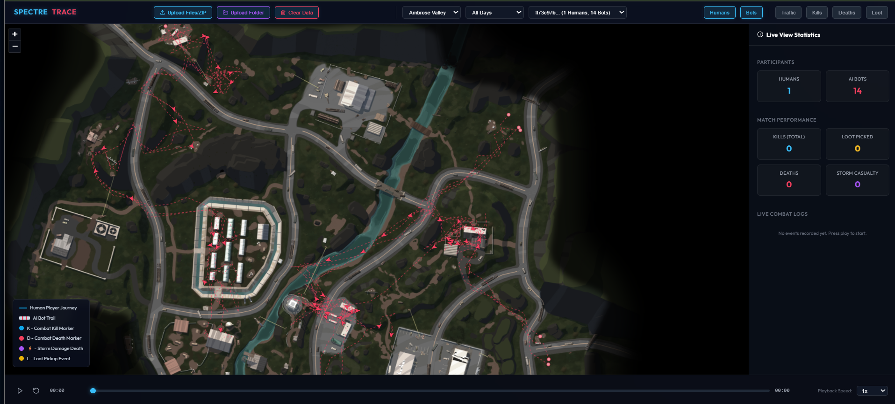
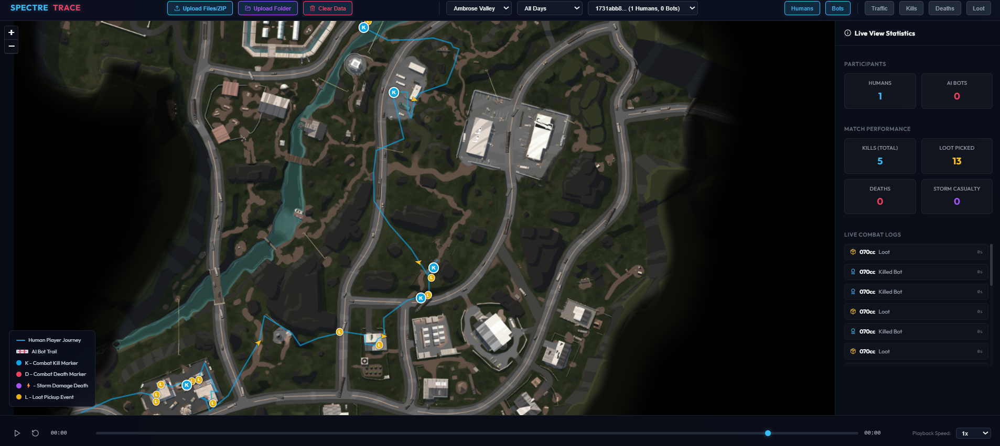

# SPECTRE TRACE - Player Telemetry Visualizer

This repository contains the source code for **SPECTRE TRACE**, a premium player telemetry visualization dashboard built for Battle Royale level design analytics. The tool runs as a decoupled web application designed to track player paths, combat events, storm zones, traffic heatmaps, and spatial choices.

---

## Showcase

### 🤖 Bot-Heavy Match Analysis (Chaotic Wandering Loops)

*Visualizing multiple AI Bot trajectory lines (Pink Dashed Trails) localized in tight patrol quadrants.*

### 🎯 Human Player Match Analysis (Linear Tactical Rotation)

*Tracking a Human player's path (Cyan Solid Trail) navigating road networks, looting POIs, and engaging in combat checkpoints.*

---

## Deployed URL
The project is hosted and accessible at: **[http://localhost:3000](http://localhost:3000)** (when running locally).

---

## Tech Stack & Architecture

### Backend Microservice
- **FastAPI**: High-performance REST API backend.
- **Polars / PyArrow**: Fast Parquet file querying and path aggregations.
- **Wipe on Start**: Automatically clears stored telemetry files on boot to start fresh with zero default matches.
- **Port**: Runs locally on port `8000`.

### Frontend Microservice
- **React + Vite + TypeScript**: Premium SPA client dashboard.
- **Leaflet.js**: Cartesian coordinate mapping using Simple CRS (Coordinate Reference Systems).
- **Lucide React**: Clean vector icons.
- **Dynamic Zoom Scaling**: Scalable chevrons and combat markers using CSS custom variables.
- **Interactive Log Seek**: Click on combat logs to warp the playback timeline.
- **Clear Data Widget**: Delete uploaded telemetry files at runtime.
- **Port**: Runs locally on port `3000`.

---

## Environment Variables
- `PORT` (Optional): Port overrides for backend/frontend services (defaults to `8000` / `3000`).

---

## Setup and Installation

### Prerequisites
- Node.js (v18+)
- Python (3.9+)

### Step 1: Clone and Restore Telemetry Data
Make sure the `player_data` directory is placed in the project root:
```
e:\LA\
├── backend\
├── frontend\
└── player_data\
```

### Step 2: Install Root Dependencies
In the root directory, install the required runner packages (like `concurrently` which runs backend and frontend at the same time):
```bash
npm install
```

### Step 3: Set up Backend Service
1. Navigate to the backend directory:
   ```bash
   cd backend
   ```
2. Install Python dependencies:
   ```bash
   pip install -r requirements.txt
   ```
3. (Optional) Run the backend separately:
   ```bash
   python run.py
   ```

### Step 4: Set up Frontend Web App
1. Navigate to the frontend directory:
   ```bash
   cd ../frontend
   ```
2. Install frontend npm dependencies:
   ```bash
   npm install
   ```
3. (Optional) Run the frontend separately:
   ```bash
   npm run dev
   ```

---

## Running the Application

To start both the backend API and the frontend dashboard concurrently, navigate to the **root directory** and simply run:
```bash
npm start
```
*The web UI will automatically open and be accessible at **http://localhost:3000**.*
